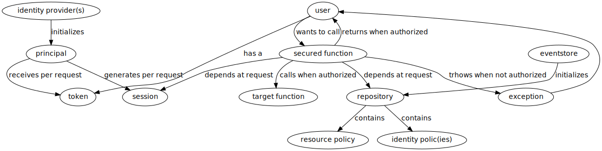

# Saku Document Policu Security Model

Provides a security system and policy language for managing security
policies for resources and identities and matching them for granting
or denying access.

## Table of Content

* [Overview](#overview)
* [Concepts](#concepts)
  * [Actions](#actions)
  * [Effects](#effects)
  * [Resources and Identities](#resources-and-identities)
  * [Identifying Resources and Identities](#identifying-resources-and-identities)
  * [Resource-based Policies](#resource-based-policies)
  * [Identity-based Policies](#identity-based-policies)
* [Policies Details](#policies-details)
  * [Wildcard Matching](#wildcard-matching)
  * [Detailed Resource-based Policies](#detailed-resource-based-policies)
  * [Detailed Identity-based Policies](#detailed-identity-based-policies)
* [Policies Evaluation](#policies-evaluation)


## Overview

This module provides the most foundational components of a role-based
access control system over a generic resource system and dependent on
a standard mechanism for security policy documents.

In a **role-based access control system**, a user can assume several
roles (identities) and these have specific access to resources.

In a **generic resource system**, resource types can be defined
abstractly. They represent categories of resources that can be reused
throughout the system.

Both, identities and resources, can have **optional security policy
documents** attached to them. These documents describe what can be
done by whom and where.

## Concepts

In a nutshell, a user can assume several **identities** when trying to
perform an **action** over a target **resource**. The system will
evaluate the **security policies** from the user's identities and the
target resource for said action and either **allow** or **deny**
access (**effect**).

The three inputs to the system are: Intended Action, Target Resource,
and User's Identities. The system has a repository for storing and
fetching the related Resource Policy and Identities Policies
Documents. The evaluation of these will result in an Effect.

### Actions

Actions represent either what users what to do over or what they can
do over certain resources.

Actions are simple strings that, by convention, are in the format
`<shortspace>/<Verb><Resource>` (i.e. `streams/ReadStream` or
`streams/CreateSubscription`).

Each resource type has a subset of available actions to it. See
[Resource Type Management
Functions](#resource-type-management-functions) for more details.

### Effects

Effects are either the resulting effects of the policies evaluation
(once the applying policies are evaluated) or the desired effects
expressed in the policies themselves.

Effects are simple `DENY` or `ALLOW` strings and their meaning should
not be a mystery. Policy evaluation assumes that a deny effect is
always implicit, an explicitly deny trumps anything and an impeded
explicit allow must be available for the final effect to be allow. See
[Policies Evaluation](#policies-evaluation) for more details.

### Resources and Identities

Resources are generic representations of assets that can have security
policies attached to them.

Anything that can be accessed by users in one way or another
(described by actions - see [above](#action)) is a resource.

Along these lines, identities are also represented as resources for
most intents and purposes. There are specific actions that can be
performed over identities.

Identities are therefore special categories of resources that can be
used to attach roles (identities) to users (principals).

### Identifying Resources and Identities

Resources and identities are identified by their `drn` (or Domain
Resource Notation). The `drn` can be composed as anything that makes
sense to identify resources and identities within your domain. We
recommend using somehting along the lines of a hierarchical ID such
as:

``` text
drn::<service>/<orgid>/<userid>/<resourcetypeid>/<resourceid>
```
Examples:

- `drn::product-catalog/my-org/my-user/product/CsWRVdXtHoYRbmKvGbKtD`
  represents the resource `CsWRVdXtHoYRbmKvGbKtD` of the resource type
  `product` within user `my-user`, organization `my-org` for service
  `product-catalog`.
- `authorization-service/my-org/role/admin` represents the identity
  `admin` of the type `roles` within the organization `my-org` for
  service `authorization`. Of course, we don't need a `my-user`
  because there is no reason to specify the existence of a single role
  within the context of a user.

### Resource-based Policies

When security policies are attached to resources they represent a
series of statements for actions that can be a) attempted over that
very resource which this policy is attached to, b) which identities
those statements apply to, and c) the resulting effect for these
statements.

For more details on how policies are evaluated, refer to [Policies
Evaluation](#policies-evaluation).

Refer to [Detailed Resource-based
Policies](#detailed-resource-based-policies) for more details.

Hypothetical example for a possible resource called
`drn::catalog-service/my-org/my-user/my-stream` allowing security actions
(`security/*`) to users under the
`authorization-service/my-org/role/ops` identity while denying reading
and listing of streams (`streams/ReadStream` and
`streams/ListStreams`) for `accounting` and `billing` roles:

``` json
{
  "drn": "drn::catalog-service/my-org/my-user/my-stream",
  "statements": [
    {
      "actions": [
        "security/*"
      ],
      "identities": [
        "authorization-service/my-org/role/ops"
      ],
      "effect": "ALLOW"
    },
    {
      "actions": [
        "streams/ReadStream",
        "streams/ListStreams"
      ],
      "identities": [
        "authorization-service/my-org/role/accounting",
        "authorization-service/my-org/role/billing"
      ],
      "effect": "DENY"
    }
  ]
}
```

### Identity-based Policies

When security policies are attached to identities they represent a
series of statements for actions that can be a) attempted over the
resource each statement specifies, b) under the identity this policy
is attached to, and c) the resulting effect for these statements.

For more details on how policies are evaluated, refer to [Policies
Evaluation](#policies-evaluation).

Refer to [Detailed Identity-based
Policies](#detailed-identity-based-policies) for more details.

Hypothetical example for a possible identity called
`authorization-service/my-org/role/ops` allowing security actions
(`security/*`) over any resources under
`authorization-service/my-org/roles` and denying and subscription action
(`streams/*Subscription`) over any resource under
`drn::catalog-service/my-org/subscriptions`):

``` json
{
  "drn": "authorization-service/my-org/role/ops",
  "statements": [
    {
      "actions": [
        "security/*"
      ],
      "resources": [
        "authorization-service/my-org/role/*"
      ],
      "effect": "ALLOW"
    },
    {
      "actions": [
        "streams/*Subscription*"
      ],
      "resources": [
        "drn:streams/my-org/subscription/*"
      ],
      "effect": "DENY"
    }
  ]
}
```

## Policies Details

Security policies can be applied to resources and identities. However,
the format of the document is slightly different and the semantic
implications are also slightly different.

Both policies are organized around **statements**. Each statement is
an object containing **actions** and **effects**. **Identity
policies** also point to the **resources** such statements should be
applied to and **Resource policies** point instead to the
**identities** such statements should be applied to.

### Wildcard Matching

By default actions, resources, and identities need to match exactly
(including casing). Alternatively, one can make use of the wildcard
character `*` in statements as matching filter. For instance:

- Filter `drn::catalog-service/my-org/subscription/my-sub` on a resource will
  only match resource `drn::catalog-service/my-org/subscription/my-sub`
- Filter `drn::catalog-service/my-org/subscription/*` on a resource will
  match resources `drn::catalog-service/my-org/subscription/my-sub` and
  `drn::catalog-service/my-org/subscription/my-sub2` (etc.)
- Filter `authorization-service/my-org/role/admin` on an identity will
  only match identity `authorization-service/my-org/role/admin`
- Filter `authorization-service/my-org/role/*` on a an identity will
  match identities `authorization-service/my-org/role/alice` and
  `authorization-service/my-org/role/bob` (etc.)
- Filter `streams/ReadStream` on an action will only match action
  `streams/ReadStream`
- Filter `streams/*` on an action will match actions
  `streams/ReadStream` and `streams/CreateStream` (etc.)

You can also use multiple `*` (i.e. `*/Create*` will match any action
from any space that starts with `Create`) and also position `*`
anywhere in the expression (i.e. `streams/*Subscription` will match
any action on space `streams` that ends with `Subscription`)

### Detailed Resource-based Policies

Each resource-based policy document is an array of `statements` where
each statement is an object with an array of `actions`, and array of
`identities` and a string indicating the resulting `effect` (`ALLOW`
or `DENY`).

The mindset when composing these resource-based policies is that we
are specifying which actions can and cannot be performed by which
users' identities to the resource this policy is attached to.

`actions` and `identities` can be exact matches or use wildcards. See
[Wildcard Matching](#wildcard-matching) for more details.

Explicit denies (those specified in any applicable security policy)
have priority. Resource-based policies have priority of allows over
identity-based policies. For more details on how the policy evaluation
works, refer to [Policies Evaluation](#policies-evaluation).

The following is a hypothetical example for a possible resource called
`drn::catalog-service/my-org/my-user/my-stream` allowing security
actions (`security/*`) to users under the
`drn::authorization-service/my-org/role/ops` identity while denying
reading and listing of streams (`streams/ReadStream` and
`streams/ListStreams`) for alice and bob:

``` json
{
  "drn": "drn::catalog-service/my-org/my-user/my-stream",
  "statements": [
    {
      "actions": [
        "security/*"
      ],
      "identities": [
        "drn::authorization-service/my-org/role/ops"
      ],
      "effect": "ALLOW"
    },
    {
      "actions": [
        "streams/ReadStream",
        "streams/ListStreams"
      ],
      "identities": [
        "drn::authorization-service/my-org/role/alice",
        "drn::authorization-service/my-org/role/bob"
      ],
      "effect": "DENY"
    }
  ]
}
```

### Detailed Identity-based Policies

Each identity-based policy document is an array of `statements` where
each statement is an object with an array of `actions`, and array of
`resources` and a string indicating the resulting `effect` (`ALLOW` or
`DENY`).

The mindset when composing these identity-based policies is that we
are specifying which actions can and cannot be performed over which
resources can from our identity where this policy is attached to.

`actions` and `resources` can be exact matches or use wildcards. See
[Wildcard Matching](#wildcard-matching) for more details.

Explicit denies (those specified in any applicable security policy)
have priority. Resource-based policies have priority of allows over
identity-based policies. For more details on how the policy evaluation
works, refer to [Policies Evaluation](#policies-evaluation).

The following hypothetical example is for a possible resource called
`drn::authorization-service/my-org/role/ops` allowing security actions
(`security/*`) over any resources under
`drn::authorization-service/my-org/roles` and denying and subscription action
(`streams/*Subscription`) over any resource under
`drn::catalog-service/my-org/subscriptions`):

``` json
{
  "drn": "drn::authorization-service/my-org/role/ops",
  "statements": [
    {
      "actions": [
        "security/*"
      ],
      "resources": [
        "drn::authorization-service/my-org/role/*"
      ],
      "effect": "ALLOW"
    },
    {
      "actions": [
        "streams/*Subscription*"
      ],
      "resources": [
        "drn::catalog-service/my-org/subscription/*"
      ],
      "effect": "DENY"
    }
  ]
}
```

### Identities as Resources

One of the neat characteristics of security policies is that identities
can also behave as resources within the system. What this means is
practice is that if we want to specify which actions can and cannot be
performed by which users' identities to the identity resource this
policy is attached to, we definitely can.

For example, let's say that, in addition to the evaluation rules we
discussed in the previous session where we gave certain permissions to
`drn::authorization-service/my-org/role/ops` we also wanted to allow
another role, say `drn::authorization-service/my-org/role/super-ops`
to have access to `security/*` actions over `ops` itself. We could
simply add `super-ops` as an identity to the allow statement:

``` json
{
  "drn": "drn::authorization-service/my-org/role/ops",
  "statements": [
    {
      "actions": [
        "security/*"
      ],
      "resources": [
        "drn::authorization-service/my-org/role/*"
      ],
      "identities": [
        "drn::authorization-service/my-org/role/super-ops"
      ],
      "effect": "ALLOW"
    },
    {
      "actions": [
        "streams/*Subscription*"
      ],
      "resources": [
        "drn::catalog-service/my-org/subscription/*"
      ],
      "effect": "DENY"
    }
  ]
}
```


## Policies Evaluation

Policies are evaluated around an **intended action** over a **target
resource** under a **user's set of identities**.

Resources and identities may or may not have **security policies**
attached to them. If they do, all the relevant policies are collected
to be used in the evaluation process.

By default, any action over any resource from any identity has an
**implicit deny**. The rationale is that it's safer to assume no
access than inadvertently assume the user has access.

There are three evaluation cycles that take place in order:

1. **explicit deny evaluation**: all applicable policies are evaluated
   in search of **explicit denies**. Any explicit deny means a
   resulting deny effect.
2. **resource-based policies evaluation**: if no explicit denies are
   found in the step before, the **resource policy** of the target
   resource are evaluated in search of **explicit allows**. If they
   are found, the final decision is for an explicit allow effect.
3. **identity-based policies evaluation**: if no explicit allow is
   found in the previous step, the **identity policies** of all the
   identities the user belongs to are evaluated in search of an
   **explicit allow**. If this is found, the final decision is
   allow. If not, we default to an **implicit deny**.

The following flow diagram visually details the algorithm described
above:


## Usage

### The Basics

You'll need two stateful components: a `repository` where the system
will store its security policies and resources and a `principal` which
acts as an indentity interaction provider.

A `principal` depends on one or more `indentiy providers`. These
providers are responsible validating externally provided tokens and
converting them into authenticated identities. For instance a JWT
provider validates JWT `tokens` and returns a `session` for the
authenticated user.

Functions that you want to secure need to be wrapped by a context
aware `secured function` that protects your function call.

A graphical representation of the basics is here:


